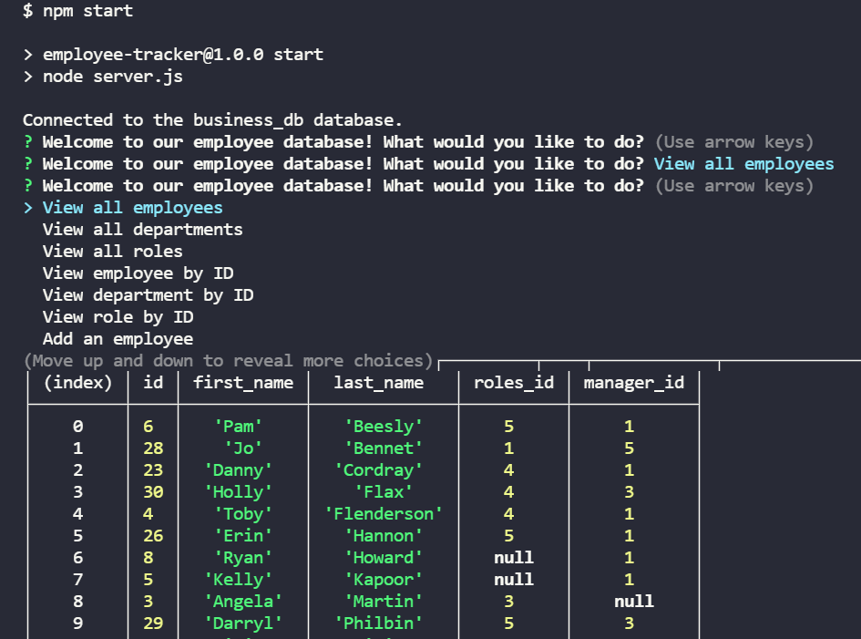

# employee-tracker

  ---

  ## Description
  
  This project is a node.js command-line application that will allow a user to maintain an employee database. Users will be able to perform CRUD functions for employees, roles, and departments. Results to user prompts are displayed in the console using `console.table`.

  ---

  ## Installation 
  Node.js, Jest, Inquirer, and MySQL are used in this application. To install, download node.js. Then clone the repo and be sure to run npm install to have access to the necessary packages for this application.

  Link to Github Repo: [https://github.com/KrisSmith7/employee-tracker](https://github.com/KrisSmith7/employee-tracker)

---

  ## Usage

  Once installed, to invoke the application, run `node server` or `npm start`. Application will begin, and instruct user to follow the prompts to view, add, update, and delete records.
  
  

  Example of the application in use can be found in the following link.
  
  [Click here to see a video of the application.](https://watch.screencastify.com/)

  ---
  ## Tests
  To run test written for this application, use command `npm test`.

  ---
  ## Questions
  Contact the developer with any questions!
  Github User: [https://github.com/KrisSmith7](https://github.com/krissmith7)